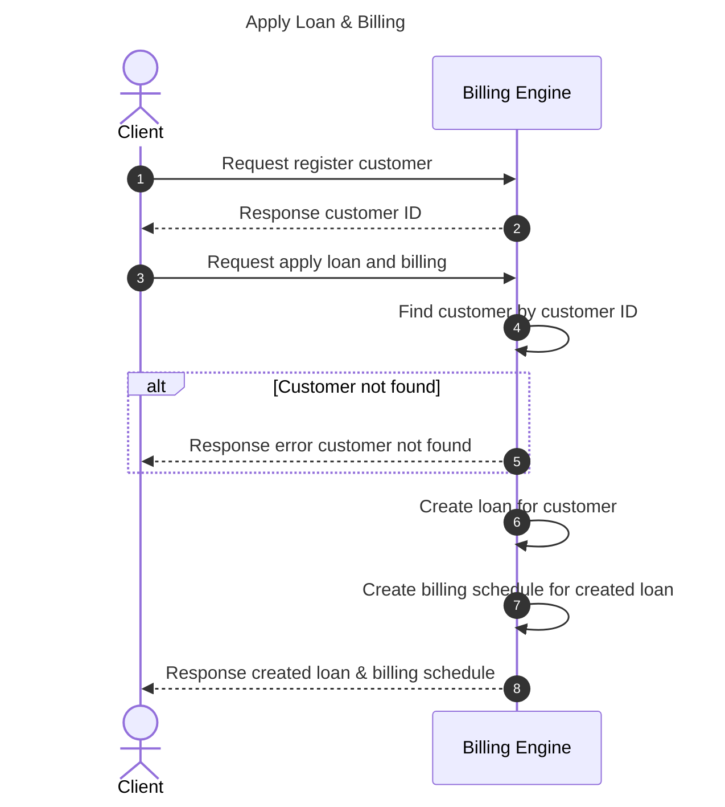
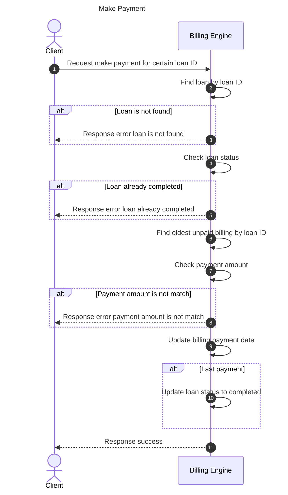
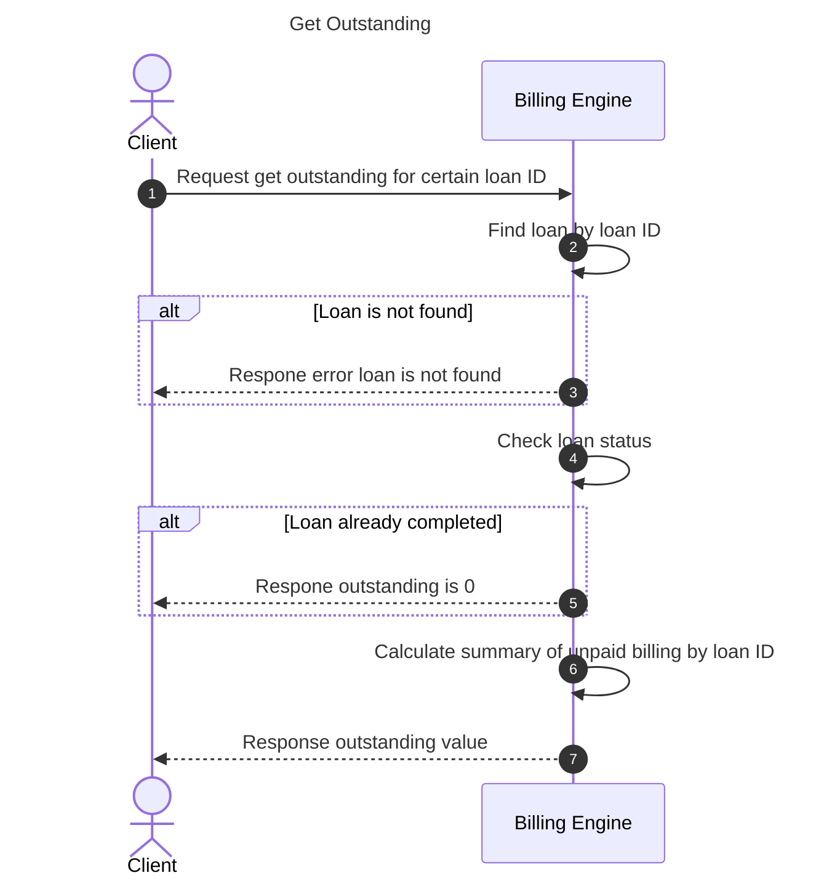
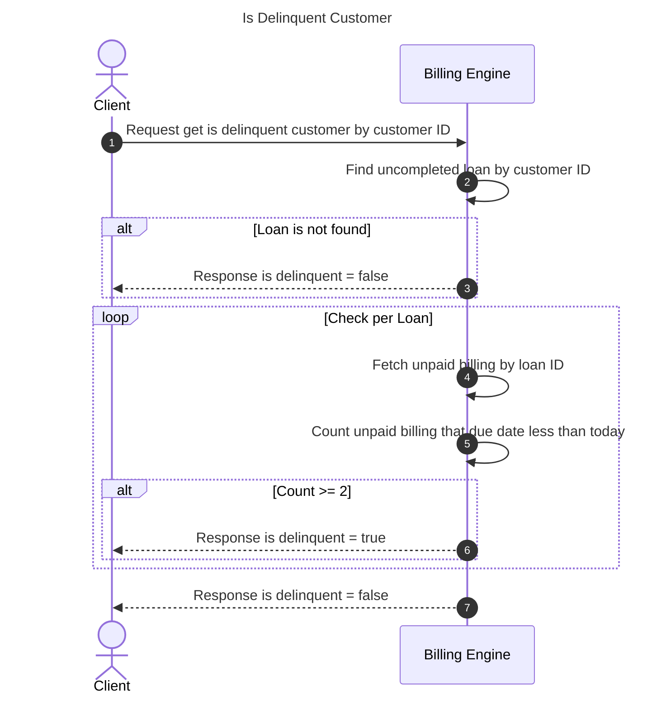

## Sequence Diagram for Billing Engine

### Apply Loan & Auto Create Billing

```mermaid
---
title: Apply Loan & Billing
---
sequenceDiagram
autonumber
actor cl as Client
participant svc as Billing Engine

cl->>svc: Request register customer
svc-->>cl: Response customer ID
cl->>svc: Request apply loan and billing
svc->>svc: Find customer by customer ID
alt Customer not found
    svc-->>cl: Response error customer not found
end
svc->>svc: Create loan for customer
svc->>svc: Create billing schedule for created loan
svc-->>cl: Response created loan & billing schedule
```

### Make Payment for certain Loan

```mermaid
---
title: Make Payment
---
sequenceDiagram
autonumber
actor cl as Client
participant svc as Billing Engine

cl->>svc: Request make payment for certain loan ID
svc->>svc: Find loan by loan ID
alt Loan is not found
    svc-->>cl: Response error loan is not found
end
svc->>svc: Check loan status
alt Loan already completed
    svc-->>cl: Response error loan already completed
end
svc->>svc: Find oldest unpaid billing by loan ID
svc->>svc: Check payment amount
alt Payment amount is not match
    svc-->>cl: Response error payment amount is not match
end
svc->>svc: Update billing payment date
alt Last payment
    svc->>svc: Update loan status to completed
end
svc-->>cl: Response success
```

### Get Outstanding

```mermaid
---
title: Get Outstanding
---
sequenceDiagram
autonumber
actor cl as Client
participant svc as Billing Engine

cl->>svc: Request get outstanding for certain loan ID
svc->>svc: Find loan by loan ID
alt Loan is not found
    svc-->>cl: Respone error loan is not found
end
svc->>svc: Check loan status
alt Loan already completed
    svc-->>cl: Respone outstanding is 0
end
svc->>svc: Calculate summary of unpaid billing by loan ID
svc-->>cl: Response outstanding value
```

### Is Delinquent Customer

```mermaid
---
title: Is Delinquent Customer
---
sequenceDiagram
autonumber
actor cl as Client
participant svc as Billing Engine

cl->>svc: Request get is delinquent customer by customer ID
svc->>svc: Find uncompleted loan by customer ID
alt Loan is not found
    svc-->>cl: Response is delinquent = false
end
loop Check per Loan
    svc->>svc: Fetch unpaid billing by loan ID
    svc->>svc: Count unpaid billing that due date less than today
    alt Count >= 2
        svc-->>cl: Response is delinquent = true
    end
end

svc-->>cl: Response is delinquent = false
```